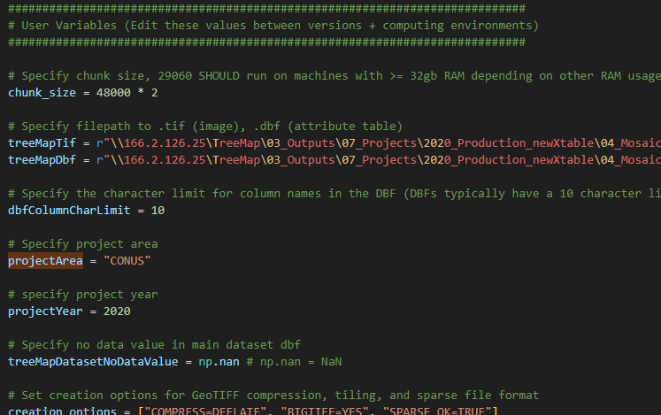
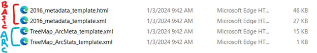
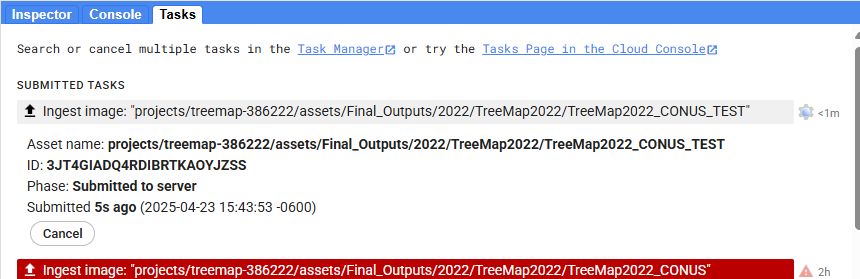

# Data Delivery Documentation

- [Data Delivery Documentation](#data-delivery-documentation)
  - [Overview](#overview)
  - [Phase 1: Create Separate Tifs for Each Attribute (`separate_attributes_to_tif.py`)](#phase-1-create-separate-tifs-for-each-attribute-separate_attributes_to_tifpy)
    - [Python Environment](#python-environment)
    - [User Variables](#user-variables)
    - [Creating Separate Attribute Tifs](#creating-separate-attribute-tifs)
    - [Creating Metadata Files](#creating-metadata-files)
      - [Create Basic Metadata Templates](#create-basic-metadata-templates)
      - [Update ArcPro Metadata Templates](#update-arcpro-metadata-templates)
      - [Run the Script to Generate Attribute Metadata](#run-the-script-to-generate-attribute-metadata)
    - [Creating Symbology Files](#creating-symbology-files)
    - [Data Packaging for the Raster Data Gateway](#data-packaging-for-the-raster-data-gateway)
  - [Phase 2: Create the TreeMap GEE Image Collection Asset (`gcloud_upload_gee_manifest.py`)](#phase-2-create-the-treemap-gee-image-collection-asset-gcloud_upload_gee_manifestpy)
    - [Install the gcloud CLI](#install-the-gcloud-cli)
    - [Python Environment](#python-environment-1)
    - [Creating the GEE Image Collection](#creating-the-gee-image-collection)
  - [Phase 3: Create an Entry for a TreeMap year in the GEE Catalog](#phase-3-create-an-entry-for-a-treemap-year-in-the-gee-catalog)
  
## Overview

Hello! This document covers the workflow for creating TreeMap deliverables, from creating separate tifs/metadata for each attribute to getting a TreeMap entry into the Google Earth Engine (GEE) catalog.

*Please note, columns and attributes are the same thing and are referenced interchangeably.*

## Phase 1: Create Separate Tifs for Each Attribute (`separate_attributes_to_tif.py`)

### Python Environment
The follow packages must be installed in your python environment for the script to run. A simple pip install should suffice:
- numpy
- gdal
- simpledbf
- pandas
- bs4

### User Variables
Update the **User Variables** section at the top of the script as needed. This is the only section of the script that should need updating between processing runs barring changes to script functionality. The comment above each variable describes its use.

### Creating Separate Attribute Tifs
Once your environment has been set up and the user variables are updated, you’re ready to use the script to generate separate attribute tifs.

**Steps:**
1.	Open whatever you use to run python and activate the environment containing the appropriate packages. I use Anaconda.
 
2.	Run `separate_attributes_to_tif.py`
 
3.	Review use considerations and type ‘images’ for the mode (do not include quotes)
 
4.	Type ‘all’ for image mode if you want to process all the attributes OR type the name of the specific attribute you want to process (e.g., 'CARBON_DOWN_DEAD')
    - NOTE: ‘all’ will skip existing attribute tifs in the output folder
 
5.	Review the paths, chunk size, and TreeMap version and press ‘enter’ if they are correct. Otherwise, press q to quit and update the user variables as desired.
 
6.	Wait for your attribute(s) to process!

### Creating Metadata Files
Once the separate attribute tifs have been created, you can create their metadata files. The script does this by editing template metadata files found in the `gtac-treemap\data_portal_scripts\supp_files\metadata_templates` directory of the repository. 

There are four metadata files required, in two categories (basic + arc). **The basic template files need to be created for each year of TreeMap. The arc template files do not.**

 
#### Create Basic Metadata Templates
These are the basic xml + html metadata files. In previous years, they've been based off the main dataset’s metadata. They are stored in `gtac-treemap\data_portal_scripts\supp_files\metadata_templates\\{YEAR}`.
 
**Steps**

1.	Copy and paste the main dataset’s xml metadata into `gtac-treemap\data_portal_scripts\supp_files\metadata_templates\\{YEAR}`.
2.	Open the file with Visual Studio Code or another program that allows you to edit xml/html.
3.	Edit the text in the file as you please. (e.g., remove/add information)
    - If deleting any xml or html tags, make sure you know what you’re doing.
4.	Add the following text in places where you want each attribute to populate its unique information:
    - {col_name}
        - Insert this text, with the curly brackets, anywhere you want each attribute’s unique name to appear. (e.g., FORTYPCD will appear in its own metadata while ALSTK will appear in its own metadata)
    - {col_description}
        - Insert this text, with the curly brackets, anywhere you want each attribute’s unique description to appear.
    - {date}
        - Insert this text, with the curly brackets, anywhere you want the date the metadata was generated to appear.
    - {data_gateway_link}
        - Insert this text, with the curly brackets, anywhere where you want the data gateway to appear.
5.	Save the file and rename it in this format: 
    - YEAR_metadata_template.xml (e.g., 2016_metadata_template.xml)
6.	Repeat all steps for the html metadata.

#### Update ArcPro Metadata Templates
These are the ESRI compatible metadata files and are based on the attributes’ basic metadata that gets generated. These templates do NOT need to be updated or created for new years of TreeMap. They may need to be updated for new versions of ArcGIS Pro, although this is unlikely. They are stored in `gtac-treemap\data_portal_scripts\supp_files\metadata_templates`.

#### Run the Script to Generate Attribute Metadata
Once the basic and arc metadata templates are ready, you can run the script to generate the attribute metadata.

**Steps:**
1.	Open whatever you use to run python and activate the environment containing the appropriate packages. I use Anaconda.
 
2.	Run `separate_attributes_to_tif.py`
 
3.	Review use considerations and type ‘meta’ for the mode (do not include quotes)
 
4.	Choose a metadata mode:
    - ‘all’ - generates basic and arc metadata for every attribute.
    - 'basic' - generates basic metadata for every attribute.
    - 'arc' - generates arc metadata for every attribute.
 
5.	Review the paths, chunk size, and TreeMap version and press ‘enter’ if they are correct. Otherwise, press q to quit and update the user variables as desired.
 
6.	Wait for the metadata to process!

### Creating Symbology Files
We created symbology files for continuous (NOT thematic or ordinal) attributes of TreeMap 2016 so users could synchronize the visualization with the TreeMap viewer in ArcGIS Pro and QGIS. These must be manually created before the ‘Packaging’ step. Each year’s layer files must be stored in their own folder, named after the year, in the symbology_files folder. (e.g., gtac-treemap\data_portal_scripts\symbology_files\2016)
 
**Steps:**
1.	Add all the attribute tifs to ArcGIS Pro.
2.	Design their symbology.
3.	Export each layer as a layer file.
4.	Save each one to the folder of its respective year (e.g., gtac-treemap\data_portal_scripts\symbology_files\2020)
5.	Repeat in QGIS with qml exports

### Data Packaging for the Raster Data Gateway
Once the attribute tifs and metadata have been generated, and you’ve designed the symbology files for each attribute, you can run the packaging portion of the script to zip all the files together. The script generates a readme with explanations of each of the files included in the zip.
   
**Steps:**
1.	Open whatever you use to run python and activate the environment containing the appropriate packages. I use Anaconda.
 
2.	Run `separate_attributes_to_tif.py`
 
3.	Type ‘package’ for mode
 
4.	Review the paths and TreeMap version. Press enter if correct. 
    - The ‘attribute tifs and metadata folder’ should be the folder where the tifs + metadata are stored.
 
5.	Wait for processing to finish. A folder, `00_Zipped_Files`, will be created in the outputFolder with all the zipped files.

6. Communicate with whoever stewards the Raster Data Gateway to upload the zip files to the site.

## Phase 2: Create the TreeMap GEE Image Collection Asset (`gcloud_upload_gee_manifest.py`)

### Install the gcloud CLI
The gcloud CLI is how the script uploads the separate attribute tifs to Google Cloud, where it is then used to manifest an Earth Engine asset. Follow the steps [here](#https://cloud.google.com/sdk/docs/install) to install it. 

**After installation, make sure to initialize the project (instructions in the link).**

### Python Environment
The follow packages must be installed in your python environment for the script to run. A simple pip install should suffice:
- earthengine-api
- geeViz

### Creating the GEE Image Collection
After gcloud and the Python environment have been set up, you're ready to create the GEE image collection by running the `gcloud_upload_gee_manifest.py` script.

**Steps:**
1. Edit the user variables for the CONUS or Alaska study area.
2. Run the Script.
    - You may be prompted to sign into GEE and/or select a project.
3. Wait for the image collection to manifest in GEE.
    - This can take a couple hours. Progress can be checked within the GEE Code Editor's `Tasks` tab.

1. Repeat for each image you want to add to the image collection.

## Phase 3: Create an Entry for a TreeMap year in the GEE Catalog
**WORK IN PROGRESS**

**Steps:**
1. Clone and fork off of the [earthengine-catalog](https://github.com/google/earthengine-catalog) repository.
2. Copy a previous TreeMap year's jsonnet file.
   - These can be found in the `earthengine-catalog\catalog\USFS` directory of the repository.
3. Edit the new jsonnet file for the new TreeMap year.
    - Save it in the `earthengine-catalog\catalog\USFS` directory.
4. Create a pull request.

